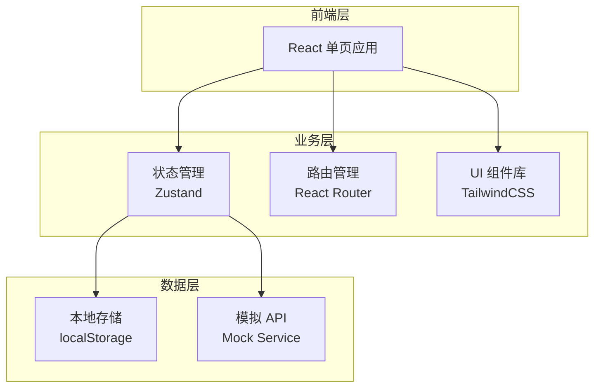

# 内推交换平台 - 技术架构文档

## 1. 架构设计



## 2. 技术栈

- **前端框架**：React 18 + TypeScript
- **构建工具**：Vite
- **样式方案**：TailwindCSS 3
- **路由管理**：React Router v6
- **状态管理**：Zustand
- **图标库**：Lucide React
- **数据模拟**：Mock 数据（localStorage 持久化）

## 3. 路由定义

| 路由 | 页面名称 | 功能描述 |
|------|----------|----------|
| / | 首页/职位广场 | 职位列表、筛选搜索 |
| /exchange | 交换大厅 | 智能匹配、申请管理 |
| /profile | 个人主页 | 用户资料、简历管理 |
| /messages | 消息中心 | 对话列表、聊天窗口 |
| /credit | 信用中心 | 信用评分、记录查看 |
| /login | 登录页 | 用户认证 |
| /job/:id | 职位详情 | 查看职位详情并申请 |
| /chat/:userId | 私聊窗口 | 与用户一对一沟通 |

## 4. 数据模型

### 4.1 用户模型

```typescript
interface User {
  id: string;
  nickname: string;
  avatar: string;
  role: 'seeker' | 'employee';
  city: string;
  industry: string;
  workYears: number;
  creditScore: number;
  jobIntention?: {
    position: string;
    city: string;
    salaryRange: [number, number];
  };
  resumeSummary?: {
    education: string;
    experience: string[];
    skills: string[];
  };
  isVerified: boolean;
  createdAt: number;
}
```

### 4.2 职位模型

```typescript
interface Job {
  id: string;
  publisherId: string;
  title: string;
  company: string;
  industry: string;
  city: string;
  salaryRange: [number, number];
  description: string;
  requirements: string[];
  slots: number;
  appliedCount: number;
  status: 'open' | 'closed';
  createdAt: number;
}
```

### 4.3 交换申请模型

```typescript
interface ExchangeApplication {
  id: string;
  jobId: string;
  seekerId: string;
  resumeSummary: string;
  status: 'pending' | 'accepted' | 'rejected' | 'completed';
  feedbackDeadline?: number;
  result?: 'success' | 'fail' | 'pending';
  createdAt: number;
}
```

### 4.4 消息模型

```typescript
interface Message {
  id: string;
  conversationId: string;
  senderId: string;
  content: string;
  type: 'text' | 'system' | 'feedback约定';
  createdAt: number;
}
```

### 4.5 信用记录模型

```typescript
interface CreditRecord {
  id: string;
  userId: string;
  type: 'success' | 'onTimeFeedback' | 'missedDeadline' | 'report';
  score: number;
  reason: string;
  relatedUserId?: string;
  createdAt: number;
}
```

## 5. 页面组件结构

```
src/
├── components/
│   ├── layout/
│   │   ├── Header.tsx
│   │   ├── Sidebar.tsx
│   │   └── BottomNav.tsx
│   ├── common/
│   │   ├── Button.tsx
│   │   ├── Card.tsx
│   │   ├── Badge.tsx
│   │   ├── Avatar.tsx
│   │   └── Modal.tsx
│   ├── job/
│   │   ├── JobCard.tsx
│   │   ├── JobList.tsx
│   │   └── JobFilters.tsx
│   ├── exchange/
│   │   ├── MatchCard.tsx
│   │   └── ApplicationForm.tsx
│   ├── message/
│   │   ├── ConversationList.tsx
│   │   ├── ChatWindow.tsx
│   │   └── MessageBubble.tsx
│   └── credit/
│       ├── CreditScore.tsx
│       ├── CreditHistory.tsx
│       └── SuccessCases.tsx
├── pages/
│   ├── HomePage.tsx
│   ├── ExchangePage.tsx
│   ├── ProfilePage.tsx
│   ├── MessagesPage.tsx
│   ├── CreditPage.tsx
│   ├── JobDetailPage.tsx
│   └── LoginPage.tsx
├── stores/
│   ├── userStore.ts
│   ├── jobStore.ts
│   ├── messageStore.ts
│   └── creditStore.ts
├── hooks/
│   ├── useAuth.ts
│   └── useLocalStorage.ts
├── utils/
│   ├── mockData.ts
│   └── helpers.ts
└── App.tsx
```

## 6. 状态管理设计

### 6.1 用户状态 (userStore)

- 当前登录用户信息
- 求职意向设置
- 简历摘要管理
- 认证状态

### 6.2 职位状态 (jobStore)

- 职位列表数据
- 筛选条件
- 收藏列表
- 我的发布

### 6.3 消息状态 (messageStore)

- 对话列表
- 当前聊天记录
- 未读消息计数
- 发送消息功能

### 6.4 信用状态 (creditStore)

- 信用评分
- 信用记录列表
- 成功案例数据
- 举报功能

## 7. Mock 数据初始化

平台将使用预设的 Mock 数据进行演示：

- 10+ 个模拟用户（求职者和在职员工）
- 20+ 条内推职位数据
- 多条交换申请记录
- 丰富的消息对话示例
- 信用记录历史
- 成功案例展示

所有数据将存储在 localStorage 中，支持数据持久化和重置。
